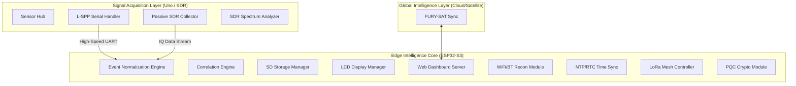

# FURIOUS Architecture: Titan-X Specification

## 1. System Overview

FURIOUS is an elastic, multi-tier Edge Intelligence Node. The 2035 expansion (Titan-X) transforms the system into a full-spectrum Signal Intelligence (SIGINT) and Cryptographic processing hub, capable of autonomous operation in contested environments.

### 1.1 Tactical Architecture Diagram

## 2. Hardware Specification

- **Core Processor**: ESP32-S3 (Dual-core 240MHz, 8MB PSRAM)
- **Sensor Acquisition**: Arduino Uno (ATMega328P)
- **SIGINT Interface**: RTL-SDR v4 via USB-OTG
- **Mesh Radio**: Semtech SX1262 (LoRa)
- **Storage**: 128GB Industrial-grade SD (UHS-I)
- **Display**: 16x2 I2C Character LCD

## 3. Communication Protocol (L-SPP v1.0)

The Light-Serial Point Protocol provides high-speed, verifiable data transmission.

- **Framing**: `[` [DELIM] `]`
- **Structure**: `[TYPE:DATA,S1:VAL,S2:VAL,CHK:HEX]`
- **Baud Rate**: 115200 (Configurable)

## 4. Operational Modules

- **WiFi Recon**: Passive SSID and BSSID extraction.
- **BT Spectral Scan**: Discovery of BLE advertisements.
- **Event Normalization**: Mapping raw sensor bytes to WHO/WHAT/WHERE/WHEN/WHY JSON.
- **LoRa Mesh**: Decentralized node-to-node relay for encrypted telemetry.

## 5. Storage Strategy

Data is stored in circular buffers on the SD card:

- `/logs/events.jsonl`: Normalized operational telemetry.
- `/logs/signals.bin`: Raw IQ captures from SDR.
- `/logs/recon.db`: SQLite identity index.

## 6. Security Constraints

- **Encryption**: AES-256-GCM for all telemetry.
- **OpSec**: Metadata-only capture by default.
- **Anti-Forensics**: Automated wipe on tamper detection.

## 7. SIGINT & Signal Intelligence

FURIOUS expanded nodes (TITAN-X) integrate Software Defined Radio (SDR) capabilities:

- **RF Spectrum Monitoring**: 24MHz to 1.7GHz passive scan.
- **Signal Identification**: Automated modulation detection (AM/FM/FSK/LoRa).
- **GMS Protocol Analysis**: Extraction of IMSI/IMEI metadata (Metadata only).

## 8. LoRa Mesh Networking

Decentralized communication for "Silent Ops":

- **Protocol**: FURY-MESH (Custom LoRa implementation).
- **Encryption**: AES-256-GCM + PQC Key Exchange.
- **Topology**: Ad-hoc mobile mesh with self-healing routing.

## 9. PQC Transition Layer

Future-proofing against quantum-assisted attacks:

- **Kyber/Dilithium Stubs**: Pre-computation of post-quantum key material.
- **Crypto-Co-processor**: Dedicated bus for cryptographic heavy-lifting.

---

**FLLC | 2026 | THE FUTURE IS QUANTUM-READY**

